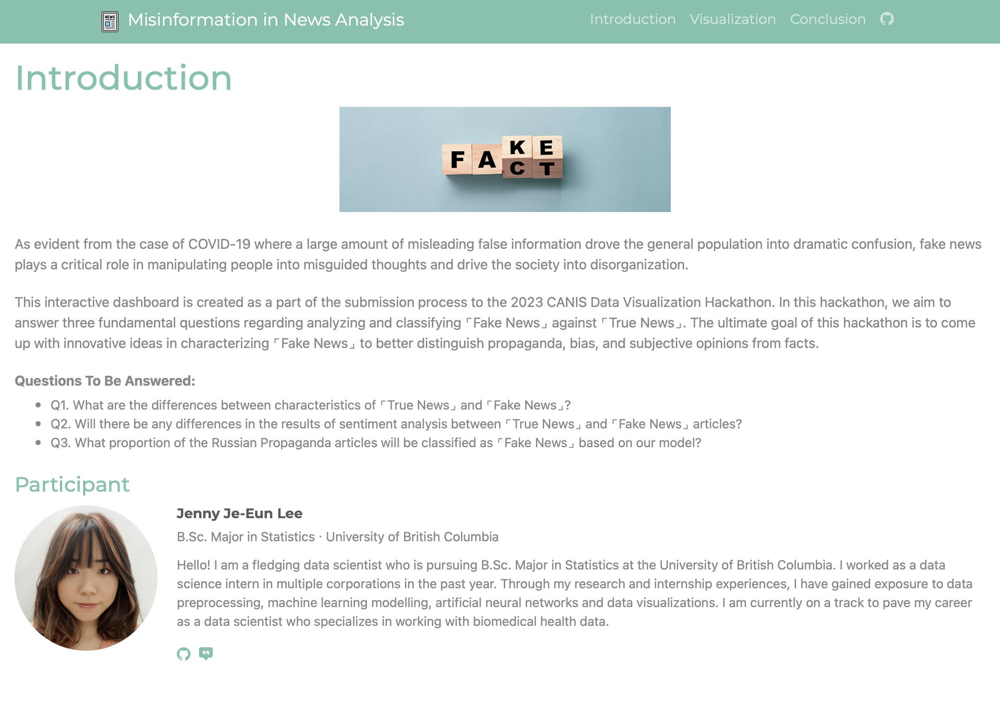

# Misinformation Analysis

In this project, I looked into characteristics and trends of the True and Fake News articles. Classification models are built using the provided data to label Russian Propaganda dataset, and observe the proportion of Fake News labels in the dataset. Hence the terminology _propaganda_ suggests, would the majority of the articles in the Russian Propaganda dataset be labelled as Fake News? I hope to derive an answer to the question through my analysis. 

🔗 [Misinformation Analysis Web-based Application](https://misinformation-analysis.herokuapp.com) 
🔗 [Presentation Video](https://www.youtube.com/watch?v=_6XdZhs73oE) 
---
## File Organization
- `raw_analysis.ipynb`: Codes for data exploration and modelling are included. All programming is done with Python.
- `visuals_creation.ipynb`: Using cleaned data to create visualizations. This code is later copy & pasted onto `pages/create_visualization.py`. 

**Outcome**:
 In total, 10 visualizations are created and can be accessed through the web-based application. 

**Warning**:
<bar>Since the original datasets and cleaned CSV files are large in size, they are not included in the current repository. Instead, you can find the original dataset in the `Conclusion` page of the web application. Cleaned CSV files can be seen in `raw_analysis.ipynb`. 

---

### What it does:
- Data Exploration & Analysis
- NLP Analysis
- Machine Learning Modelling for Fake News Detector
- News Article Categorization

### How we built it:
Visualizations are created using **Plotly**, exploratory analysis are done with **Pandas** and **Numpy**. Three machine learning classifiers are built using **Scikit-Learn** library: Logistic Regression, Support Vector Machine, Native Bayes. The interactive dashboard is made with **Plotly Dash** and deployed on **Heroku**.

### Challenges we ran into:
This was my first time creating a multi-page interactive dashboard. Although it was challenging, the experience was very rewarding as I was able to create a fully functional interactive dashboard at the end. 

### Accomplishments that we're proud of:
As the CANIS Data Visualization hackathon didn't have predetermined themes, there was a large degree of freedom in terms of how to work with the given data. I enjoyed the data cleaning and preprocessing processes, trying different NLP techniques, and building models with high accuracy values. I am also proud to take further steps in categorizing the news articles. 

### What's next for Misinformation Analysis:
Although not the most traditional approach, it would be interesting to filter data based on NLP scores (using NLTK and TextBlob libraries) prior to building a model. As we have seen in the news article categorization process, articles classified as Sports and Entertainments are more frequently seen in Fake News than True News. For such category, extra preprocessing steps can be done prior to building a model. 
